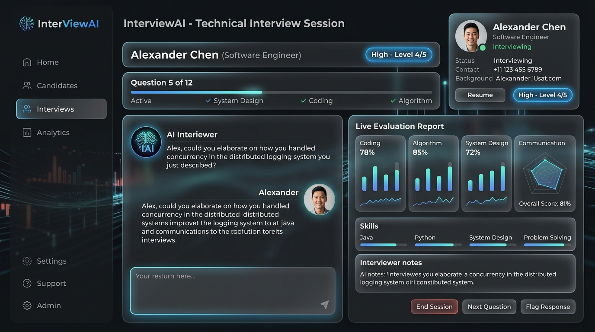

# InterviewAI - Enterprise AI Technical Interview Agent

[](https://interview-ai-agent-hoq6.onrender.com/)
[](https://interview-ai-agent-hoq6.onrender.com/docs)
[](https://github.com/gauravsoni1706/INTERVIEw-AI)

> **Live Working Application**: [https://interview-ai-agent-hoq6.onrender.com](https://interview-ai-agent-hoq6.onrender.com/)  
> **Interactive API Docs**: [https://interview-ai-agent-hoq6.onrender.com/docs](https://interview-ai-agent-hoq6.onrender.com/docs)

---

## 1. Application Screenshot & Mockup



*InterviewAI Dashboard featuring candidate selection, pre-interview profile viewer, live chat transcript with interviewer persona, phase status bar, difficulty indicator, hint generator, and structured evaluation report.*

---

## 2. Problem & Solution

### The Challenge
Traditional technical interviewing is static, generic, and fails to adapt to what a candidate actually built during their learning journey. Generic AI chatbots fail as interviewers because they lack candidate context, repeat questions, and do not probe with adaptive follow-ups.

### The Solution
**InterviewAI** acts as an autonomous AI interviewer that:
- Loads candidate profiles and 31 curriculum days dynamically from `data/curriculum.json` and `data/candidates.json`.
- Strictly respects skipped topics (never asking candidates about skipped missions as if completed).
- Starts each candidate on their exact first non-skipped mission listed in candidate data.
- Adaptively adjusts question difficulty based on candidate response depth (`Easy` $\rightarrow$ `Hard`).
- Conducts follow-up questions probing trade-offs, scalability, and error recovery.
- Maintains multi-turn conversation memory via `sessionId`.
- Enforces minimum coverage ($\ge 8$ questions, $\ge 4$ distinct curriculum days).
- Generates structured, evidence-based feedback reports (`summary`, `strengths`, `gaps`, `next`).

---

## 3. Architecture

```text
               +-----------------------------------+
               |           React Frontend          |
               | (Candidate Selector / Chat / Eval)|
               +-----------------+-----------------+
                                 |
               POST /api/interview (or /api/interview/hint)
                                 |
               +-----------------v-----------------+
               |          FastAPI Gateway          |
               +-----------------+-----------------+
                                 |
        +------------------------+------------------------+
        |                                                 |
+-------v-------+       +-------------------+     +-------v-------+
|  Candidate    |       |  Curriculum RAG   |     |  State        |
|  Context      |       |  Retriever        |     |  Machine      |
|  Builder      |       | (curriculum.json) |     | (SessionStore)|
+-------+-------+       +---------+---------+     +-------+-------+
        |                         |                       |
        +-------------------------+-----------------------+
                                  |
                      +-----------v-----------+
                      |   Interview Planner   |
                      +-----------+-----------+
                                  |
                      +-----------v-----------+
                      |   Question Generator  |
                      | (LLM / Smart Engine)  |
                      +-----------+-----------+
                                  |
                      +-----------v-----------+
                      |   Answer Evaluator &  |
                      |   Follow-up Engine    |
                      +-----------+-----------+
                                  |
                      +-----------v-----------+
                      |   Feedback Generator  |
                      +-----------------------+
```

---

## 4. Key Features

- **Dynamic Data Integrity**: Curriculum and candidate profiles loaded dynamically from source JSON files.
- **Skipped Topic Rule**: Candidates who skipped a mission (e.g. Day 29 Monitoring) are never asked questions assuming they completed it.
- **Candidate Personalization**: Starts each candidate on their exact first non-skipped mission (e.g., Day 1 for Wendy Foster, Day 7 for Sarah Johnson).
- **Adaptive Difficulty & Follow-ups**: Probes candidate choices ("Why Cosine Similarity over Euclidean?") or simplifies when answers show confusion.
- **5-Phase State Machine**: Tracks progression (`Phase 1 — Introduction` $\rightarrow$ `Phase 2 — Core` $\rightarrow$ `Phase 3 — Depth` $\rightarrow$ `Phase 4 — Scenarios` $\rightarrow$ `Phase 5 — Final Assessment`).
- **💡 Hint & Reference Model Answers**: Provides sample model answers and objective reference guides for all 31 curriculum days.
- **Evidence-Based Feedback**: Generates structured evaluation report containing `summary`, `strengths`, `gaps`, `next`, 6-axis metrics, category breakdown, and Mermaid architecture diagram.

---

## 5. API Specification

Complies strictly with `technical-spec.md`:

### Endpoint
`POST /api/interview`

### Start Interview Payload
```json
{
  "candidate": "CAND-001",
  "personality": "Senior Engineer"
}
```
**Response:**
```json
{
  "reply": "Hi Sarah. I see you've completed key missions...",
  "done": false,
  "sessionId": "session_a1b2c3d4",
  "question_count": 1,
  "covered_days": [7],
  "difficulty": "Medium"
}
```

### Next Turn Payload
```json
{
  "sessionId": "session_a1b2c3d4",
  "message": "Sentence Transformers output 384 or 768 dim embeddings..."
}
```
**Response:**
```json
{
  "reply": "Great explanation. Moving on to Day 8...",
  "done": false,
  "sessionId": "session_a1b2c3d4",
  "question_count": 2,
  "covered_days": [7, 8],
  "difficulty": "Hard"
}
```

### Final Response (Interview Complete)
```json
{
  "reply": "Interview completed.",
  "done": true,
  "sessionId": "session_a1b2c3d4",
  "feedback": {
    "summary": "Sarah Johnson demonstrated senior AI engineer capability with strong performance in Day 7...",
    "strengths": ["Demonstrated clear understanding of Embeddings (Day 7).", "Structured technical reasoning."],
    "gaps": ["Demonstrated less technical depth in production latency bounds."],
    "next": ["Review Day 10 — The Retrieval & Matching Engine...", "Review Day 23 — Model Context Protocol (MCP)..."]
  }
}
```

---

## 6. Quick Start Guide

### Prerequisites
- Python 3.9+
- Virtualenv

### Setup Instructions

1. **Clone & Install Dependencies:**
   ```bash
   git clone https://github.com/gauravsoni1706/INTERVIEw-AI.git
   cd INTERVIEw-AI
   pip install -r requirements.txt
   ```

2. **Run Automated Test Suite (10/10 Tests):**
   ```bash
   python -m pytest -v tests/test_interview.py
   # or
   python run_tests.py
   ```

3. **Start Local Web Server:**
   ```bash
   python main.py
   ```

4. **Access Web App & API:**
   - Web App: `http://localhost:8000`
   - REST API Docs: `http://localhost:8000/docs`

---

## 7. Project Structure

```
.
├── app/
│   ├── feedback_engine.py   # Feedback report & score generation
│   ├── interview_engine.py  # 5-Phase state machine, follow-ups & model answers
│   ├── llm_provider.py      # LLM abstraction (Gemini, OpenAI, Claude, Offline)
│   ├── models.py            # Pydantic data schemas & API payloads
│   └── rag_engine.py        # RAG semantic retriever over curriculum.json
├── data/
│   ├── candidates.json      # Candidate profiles & mission records
│   └── curriculum.json      # 31-Day Enterprise AI Cohort curriculum
├── docs/
│   └── screenshot.jpg       # Application UI screenshot mockup
├── static/
│   └── index.html           # Single-page glassmorphic React dashboard
├── tests/
│   └── test_interview.py    # Pytest integration suite (10 automated tests)
├── .env.example             # Environment variable template
├── Dockerfile               # Production Docker container definition
├── docker-compose.yml       # Docker compose service definition
├── main.py                  # FastAPI application entrypoint
├── PROMPTS.md               # AI System Prompt Audit Log
├── README.md                # Project documentation with screenshot & live link
├── requirements.txt         # Python dependencies
└── run_tests.py             # Test execution runner script
```
